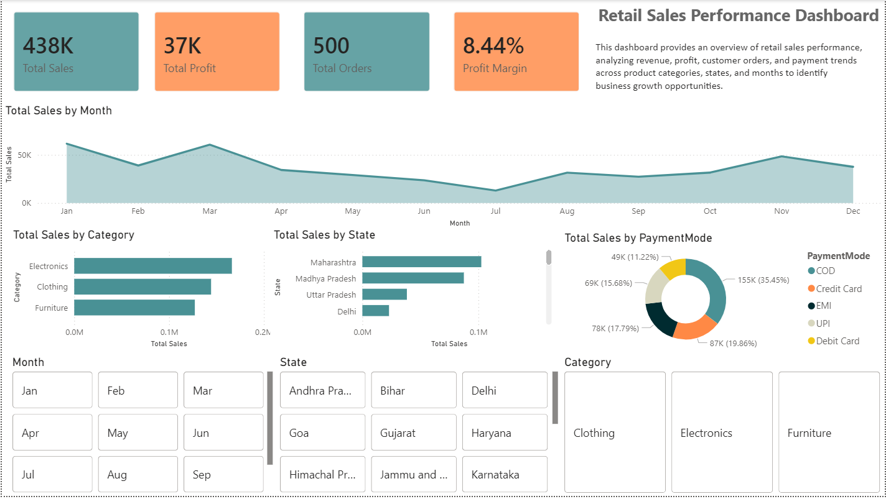
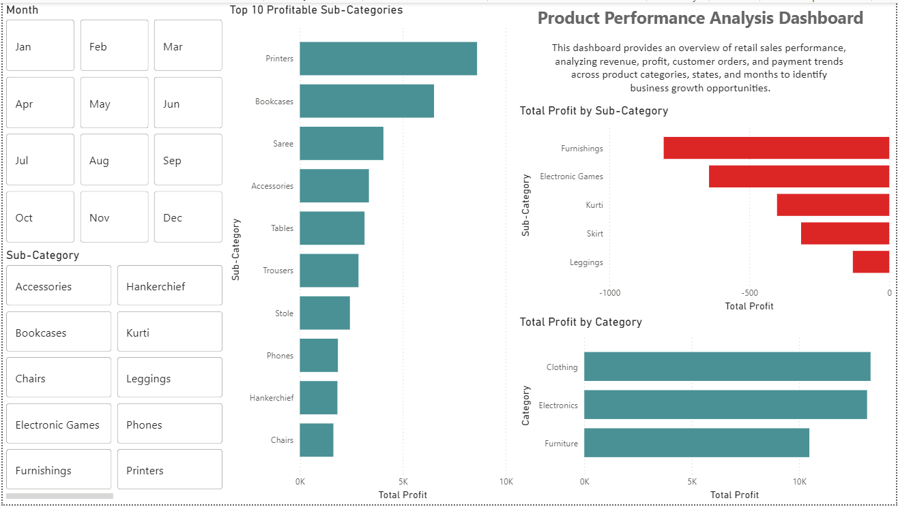

# Retail Sales Performance Dashboard (Power BI)

## 📊 Project Overview

This project presents a Retail Sales Performance Dashboard built using Power BI. The dashboard provides insights into sales performance, profit trends, customer orders, and payment behavior across different categories, states, and months.

## 🎯 Business Objective

To analyze retail business performance and identify key trends in sales, profit, and customer purchasing behavior to support data-driven decision-making.

## 📁 Dataset Details

The dataset consists of two tables:

**Orders Table**

* Order ID
* Order Date
* Customer Name
* City
* State

**Sales Details Table**

* Order ID
* Amount
* Profit
* Quantity
* Category
* Sub-Category
* Payment Mode

## 📂 Project Files

- Retail_Sales_Performance_Dashboard.pbix → Power BI dashboard file  
- Orders.xlsx → Orders dataset  
- Details.xlsx → Sales details dataset  
- dashboard_preview.png → Dashboard screenshot  
- README.md → Project documentation  

## 📌 Key Features

* KPI Cards (Total Sales, Profit, Orders, Profit Margin)
* Monthly Sales Trend Analysis
* Sales by Product Category
* Sales by State
* Payment Mode Distribution
* Interactive Filters (Month, State, Category)

## 🛠 Tools Used

* Power BI
* Power Query
* DAX
* Data Modeling

### Executive Dashboard

### Product Analysis Dashboard

## 📈 Key Insights

* Electronics category generated the highest revenue.
* Maharashtra recorded the highest total sales.
* COD is the most preferred payment method.
* Sales peaked during March and November.

## 👤 Created By

Ebin Francis
Data Analyst

